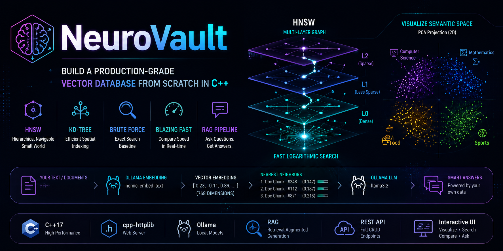
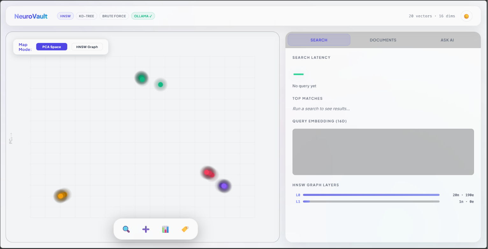
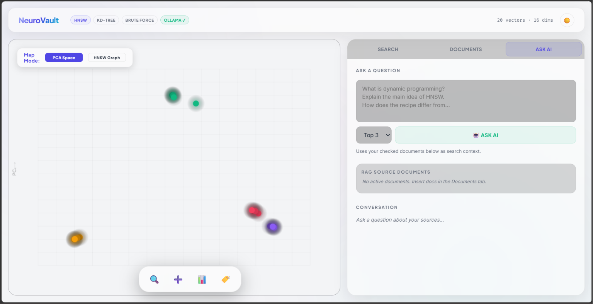

# <p align="center">🧠 NeuroVault</p>

<p align="center">
  
</p>

<p align="center">
  
</p>

<p align="center">


</p>

<p align="center">
Build a Production-Grade Vector Database from Scratch in C++
</p>

<p align="center">
HNSW • KD-Tree • Vector Search • Semantic Search • RAG • Ollama
</p>

---

# 🚀 Overview

NeuroVault is a fully functional **Vector Database Engine** built completely from scratch in **C++17**.

The project demonstrates the core technologies behind modern vector databases such as:

* Pinecone
* Weaviate
* Chroma
* Milvus

NeuroVault implements multiple nearest-neighbor search algorithms, supports semantic document search using embeddings, and includes a complete Retrieval-Augmented Generation (RAG) pipeline powered by Ollama.

Live Demo -> https://musky-amusing-dazzling.ngrok-free.dev/

---

# ✨ Features

| Feature                  | Description                                          |
| ------------------------ | ---------------------------------------------------- |
| ⚡ HNSW                   | Production-grade Approximate Nearest Neighbor Search |
| 🌳 KD-Tree               | Efficient Spatial Indexing                           |
| 🔍 Brute Force           | Exact Search Baseline                                |
| 📏 Multiple Metrics      | Cosine, Euclidean, Manhattan                         |
| 📊 PCA Visualizer        | Interactive Semantic Space Projection                |
| 📄 Document Embeddings   | Real Embeddings via Ollama                           |
| 🤖 RAG Pipeline          | Context-Aware Question Answering                     |
| 🌐 REST API              | Full CRUD Endpoints                                  |
| 📈 Benchmarking          | Compare Search Algorithms                            |
| 🎨 Interactive Dashboard | Modern Visualization UI                              |

---

# 🏗 System Architecture

```text
                User Query
                     │
                     ▼
      ┌───────────────────────────┐
      │   Ollama Embedding Model  │
      │   nomic-embed-text        │
      └─────────────┬─────────────┘
                    │
                    ▼
             Vector Embedding
                    │
                    ▼
       ┌──────────────────────────┐
       │        HNSW Index        │
       │        KD-Tree           │
       │      Brute Force         │
       └────────────┬─────────────┘
                    │
                    ▼
          Nearest Neighbor Search
                    │
                    ▼
            Retrieved Context
                    │
                    ▼
              Ollama LLM
              (llama3.2)
                    │
                    ▼
               AI Response
```

---

# 🧠 Search Algorithms

## ⚡ HNSW

Hierarchical Navigable Small World

* Multi-layer graph structure
* Logarithmic search complexity
* State-of-the-art ANN algorithm
* Used by modern vector databases

### Complexity

```text
Brute Force : O(N)

HNSW        : O(log N)
```

---

## 🌳 KD-Tree

* Space partitioning data structure
* Recursive dimension splitting
* Efficient nearest-neighbor lookup
* Excellent educational comparison against HNSW

---

## 🔍 Brute Force

* Exact search results
* No indexing required
* Ground truth benchmark

---

# 📏 Distance Metrics

### Cosine Similarity

Best suited for semantic embeddings.

```text
Measures angle between vectors
```

### Euclidean Distance

```text
Straight-line distance
```

### Manhattan Distance

```text
Grid-based distance
```

---

# 📊 Interactive Visualization

NeuroVault includes a PCA-based scatter plot visualization.

Semantic vectors are projected into 2D space allowing users to observe clustering behavior.

### Demo Categories

* 💻 Computer Science
* 📐 Mathematics
* 🍜 Food
* 🏀 Sports

Users can visually explore vector relationships and observe how semantic search behaves.

---

# 🤖 Retrieval-Augmented Generation (RAG)

Upload documents and ask questions about them.

### Pipeline

```text
Document
   │
   ▼
Chunking
   │
   ▼
Embedding
   │
   ▼
HNSW Index
   │
   ▼
Top-K Retrieval
   │
   ▼
Context Injection
   │
   ▼
LLM Generation
   │
   ▼
Answer
```

Everything runs locally using Ollama.

No external APIs required.

---

# ⚙️ Tech Stack

<p align="center">


</p>

| Layer         | Technology                 |
| ------------- | -------------------------- |
| Language      | C++17                      |
| Backend       | cpp-httplib                |
| Frontend      | HTML, CSS, JavaScript      |
| Search Engine | HNSW, KD-Tree, Brute Force |
| Embeddings    | Ollama + nomic-embed-text  |
| LLM           | llama3.2                   |
| Visualization | PCA Projection             |
| API           | REST                       |

---

# 📂 Project Structure

```text
NeuroVault
│
├── main.cpp
├── httplib.h
├── index.html
│
├── docs
│   ├── architecture.md
│   ├── hnsw.md
│   ├── rag.md
│   └── api.md
│
├── assets
│   ├── neurovault-banner.png
│   ├── dashboard.png
│   ├── search.png
│   └── rag.png
│
└── README.md
```

---

# ⚡ Quick Start

## Clone Repository

```bash
git clone https://github.com/YOUR_USERNAME/NeuroVault.git

cd NeuroVault
```

---

## Install Ollama Models

```bash
ollama pull nomic-embed-text

ollama pull llama3.2
```

---

## Compile

```bash
g++ -std=c++17 -O2 main.cpp -o db -lws2_32
```

---

## Run

```bash
./db
```

Open:

```text
http://localhost:8080
```

---

# 🌐 REST API

## Search

```http
GET /search
```

Example

```http
/search?v=f1,f2,f3&k=5&metric=cosine&algo=hnsw
```

---

## Insert Vector

```http
POST /insert
```

---

## Delete Vector

```http
DELETE /delete/:id
```

---

## Benchmark Algorithms

```http
GET /benchmark
```

Compare:

* HNSW
* KD-Tree
* Brute Force

side-by-side.

---

## RAG Question Answering

```http
POST /doc/ask
```

Request:

```json
{
  "question": "What is a process?",
  "k": 3
}
```

---

# 📸 Screenshots

## Dashboard



---

## Semantic Search



---

## RAG Pipeline


---

# 🎓 Learning Outcomes

This project demonstrates practical understanding of:

* Vector Databases
* Approximate Nearest Neighbor Search
* HNSW Graph Construction
* KD-Tree Traversal
* Semantic Search
* Retrieval-Augmented Generation
* Embedding Pipelines
* REST API Design
* Interactive Data Visualization


---

# ⭐ Support

If you found this project useful, consider giving it a star.

It helps others discover the project and motivates future improvements.

---

# 📜 License

MIT License

---

<p align="center">

Built with ❤️ using C++17

</p>
